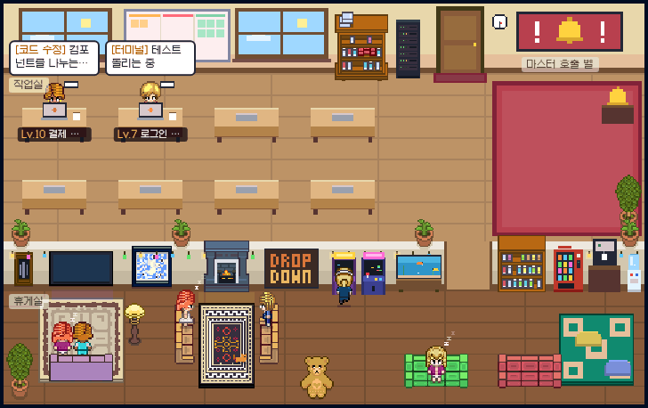
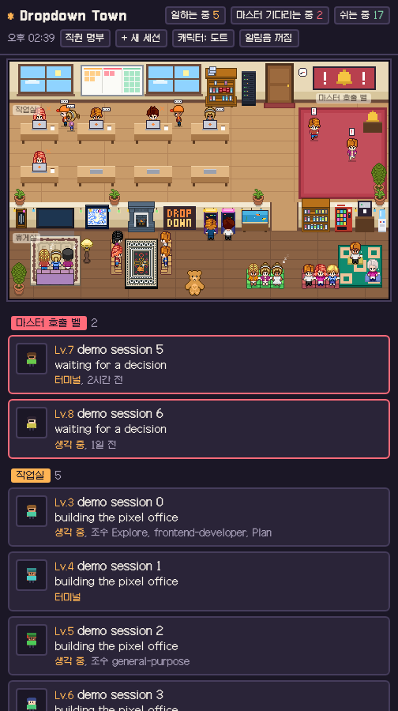
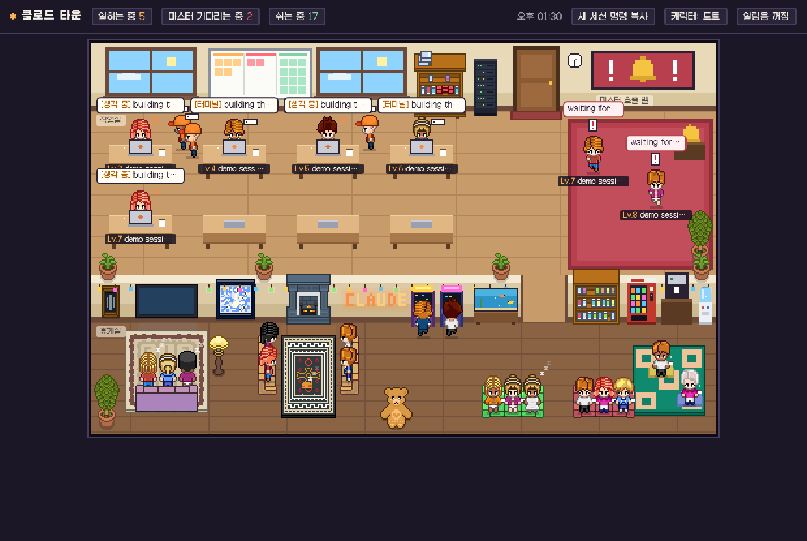

# Dropdown Town

**내 맥에서 일하는 Claude Code 세션들을 픽셀 사무실로 구경하고 다루는 앱**

**Watch and manage your Claude Code sessions in a tiny pixel office.** [English guide below](#english)





> 지금은 **macOS 전용**이고, **Claude Code** 세션만 보여줍니다. Anthropic 과 관련 없는 비공식 개인 프로젝트입니다.


## 한국어

### 한눈에 보기

Claude Code 로 여러 일을 동시에 시켜 두면, 누가 일하고 있고 누가 내 답을 기다리는지 놓치기 쉽습니다. Dropdown Town 은 그 세션들을 픽셀 캐릭터로 바꿔 사무실 한 장면으로 보여줍니다.

| 어디에 있나 | 무슨 뜻인가 |
| --- | --- |
| 작업실 책상 | 일하는 중입니다. 말풍선에 지금 하는 일이 나옵니다. |
| 책상 옆에 선 캐릭터 | 그 세션이 부른 서브에이전트(조수)입니다. |
| 빨간 카펫의 호출 벨 | 내 답을 기다리며 멈춰 있습니다. 가장 먼저 챙길 세션입니다. |
| 휴게실 | 일을 끝냈습니다. TV 를 보거나, 오락기를 하거나, 오래됐으면 잡니다. |
| 왕관 | 터미널에서 내가 직접 연 세션입니다. |


세션이 가득 찬 사무실은 이런 모습입니다.




### 처음이신 분을 위한 설치 (약 5분)

개발자가 아니어도 됩니다. 아래 글자를 그대로 복사해 붙여 넣기만 하면 됩니다.

**준비. Claude Code 를 쓰고 계셔야 합니다**

이 앱은 Claude Code 가 일하는 모습을 보여주는 앱입니다. 아직 없다면 [Claude Code 설치 안내](https://claude.com/claude-code)를 먼저 따라 해 주세요.

**1단계. 터미널 열기**

키보드에서 `Command(⌘) + 스페이스`를 누르고, `터미널`이라고 친 뒤 엔터를 누릅니다. 글자를 입력하는 창이 뜹니다.

**2단계. 필요한 도구 두 가지 확인하기**

아래 줄을 복사해 터미널에 붙여 넣고 엔터를 누릅니다.

```bash
xcode-select --install
```

- 설치 창이 뜨면 "설치"를 누르고 끝날 때까지 기다립니다(몇 분 걸립니다).
- `already installed` 라는 글이 나오면 이미 있다는 뜻이니 그냥 넘어갑니다.

이어서 아래 줄을 붙여 넣습니다.

```bash
node -v
```

- `v20.11.0` 처럼 숫자가 나오면 준비된 것입니다(18 이상이면 됩니다).
- `command not found` 가 나오면 [nodejs.org](https://nodejs.org) 에서 "LTS" 설치 파일을 받아 설치한 뒤, 터미널을 껐다가 다시 엽니다.

**3단계. 내려받아서 앱 만들기**

아래 다섯 줄을 한꺼번에 복사해 붙여 넣고 엔터를 누릅니다.

```bash
cd ~
git clone https://github.com/unknownstarter/dropdown-town.git
cd dropdown-town
./build-app.sh
open "Dropdown Town.app"
```

1분 안쪽으로 사무실 창이 뜹니다. 이걸로 설치는 끝입니다.

**4단계. 다음부터 쉽게 열기**

- 창이 떠 있을 때 Dock 의 앱 아이콘을 오른쪽 클릭하고 "옵션", "Dock 에 유지"를 고릅니다. 다음부터는 Dock 에서 누르면 됩니다.
- 또는 Finder 에서 홈 폴더의 `dropdown-town` 폴더를 열고, `Dropdown Town` 앱을 "응용 프로그램" 폴더로 끌어다 놓습니다.

**사무실이 비어 있다면**

Claude Code 세션이 하나도 없으면 아무도 없는 사무실이 보입니다. 정상입니다. 터미널에서 아래처럼 일을 하나 시켜 보세요. 캐릭터가 문으로 걸어 들어옵니다.

```bash
claude --bg "이 폴더에 뭐가 있는지 요약해줘"
```


### 매일 이렇게 씁니다

| 하고 싶은 일 | 방법 |
| --- | --- |
| 세션이 무슨 일을 하는지 보기 | 캐릭터를 누릅니다. 받은 요청, 지금 하는 일, 토큰 수(레벨), PR 링크, 권한 모드(오토 모드인지)가 나옵니다. |
| 세션이 나에게 뭘 물었는지 보기 | 호출 벨 앞 캐릭터를 누르면 요청한 내용 전문이 나옵니다. 창 제목에도 기다리는 세션 수가 숫자로 뜹니다. |
| 그 요청에 답하기 | "터미널에서 열어 답하기"를 누르면 터미널에 그 세션이 열립니다. 수락과 거절을 포함한 답은 거기서 직접 합니다. |
| 일하는 세션 멈추기 | 작업실 캐릭터를 누르고 "세션 멈추기". 대화는 보존되어 나중에 이어 갈 수 있습니다. |
| 끝난 세션 지우기 | 휴게실 캐릭터를 누르고 "세션 지우기". |
| 새 일 시키기 | 오른쪽 위 "+ 새 세션"에서 프로젝트를 고르고 시킬 일을 적습니다. |
| 내 에이전트 팀 보기 | 오른쪽 위 "직원 명부". 직접 만든 직군 에이전트별로 지금 어디서 일하는지, 몇 번 불렸는지, 최근에 맡은 일이 나옵니다. |
| 조수(서브에이전트)가 뭘 하는지 보기 | 책상 옆 조수 머리 위에 최근에 쓴 도구와 마지막 말이 뜹니다. 조수를 누르면 부모 세션이 넘긴 지시문과 조수가 지금까지 한 말이 나옵니다. 조수가 결과를 돌려주면 종이비행기가 부모에게 날아갑니다. |
| 에이전트들끼리 일을 이어서 하게 하기 (릴레이) | 오른쪽 위 "릴레이". 단계별 지시문을 최대 4개 적으면, 단계마다 새 세션이 열리고 앞 단계의 마지막 말이 다음 단계로 넘어갑니다(지시문의 `{{prev}}` 자리, 없으면 끝에 붙음). 진행 중인 세션은 주황 바통을 들고, 어느 단계가 답을 기다리면 호출 벨로 나옵니다. 위쪽 표시의 "멈춤"으로 언제든 끊을 수 있습니다. 단계마다 세션 하나가 새로 열리므로 토큰이 그만큼 듭니다. |
| 캐릭터 꾸미기 | 캐릭터를 누르면 아래쪽에 별명, 몸, 머리, 옷, 장식(왕관, 고양이 귀, 리본)과 장식 색을 바꾸는 칸이 있습니다. |
| 화면 옆에 세로로 붙여 두기 | 메뉴 "보기"의 "화면 왼쪽 3분의 1에 붙이기"(⌘[)나 "오른쪽"(⌘]). 창이 좁아지면 사무실을 줄이지 않고 크게 보여주면서, 카메라가 사람이 있는 쪽을 천천히 오갑니다. 누가 호출 벨을 누르면 그쪽을 비추고, 그림을 끌거나 양옆 화살표를 눌러 직접 움직일 수도 있습니다. 아래에는 세션 카드 목록이 나옵니다. "항상 위에 두기"(⌘T)와 같이 쓰면 좋습니다. |
| 코드 편집기 옆에 작게 띄우기 | 메뉴 "보기"의 "작은 창으로"(⌘1). |
| 알림음 켜기 | 오른쪽 위 "알림음" 버튼. 세션이 나를 찾거나 일을 끝내면 소리가 납니다. |


### 자주 묻는 질문

| 질문 | 답 |
| --- | --- |
| 새 버전은 어떻게 받나요 | 터미널에 `cd ~/dropdown-town && git pull && ./build-app.sh` 를 붙여 넣고, 앱을 껐다 켭니다. |
| 지우고 싶어요 | 앱을 끄고 홈 폴더의 `dropdown-town` 폴더와 응용 프로그램의 앱을 휴지통에 넣으면 끝입니다. 다른 곳에 남기는 것이 없습니다. |
| "서버와 연결이 끊겼어요"라고 나와요 | 앱이 뒤에서 돌리는 서버가 꺼진 것입니다. 앱이 몇 초 안에 스스로 다시 켭니다. 계속 그렇다면 앱을 완전히 종료(⌘Q)했다가 다시 열고, Node 를 새로 설치했거나 바꾼 뒤라면 `cd ~/dropdown-town && ./build-app.sh` 를 다시 실행합니다. |
| 캐릭터는 나오는데 말풍선 내용이 없어요 | 하는 일 요약과 토큰 수는 백그라운드 세션(`claude --bg`)에서만 나옵니다. 터미널에서 직접 연 세션은 캐릭터만 나옵니다. |
| Claude 데스크톱 앱에서 한 것도 나오나요 | 일반 채팅과 클라우드에서 도는 세션은 나오지 않습니다(내 맥에 기록이 남지 않습니다). 데스크톱 앱의 Code 기능을 "로컬"로 돌린 세션은 터미널과 같은 폴더에 기록되므로 나올 수 있지만, 아직 직접 확인하지는 못했습니다. 하는 일 요약까지 가장 잘 보이는 것은 터미널의 `claude --bg` 세션입니다. |
| ChatGPT, Gemini 같은 다른 AI 는요 | 아직 Claude Code 만 됩니다. 로드맵에 있습니다. |
| "마스터"라는 호칭을 바꾸고 싶어요 | 브라우저 방식(아래 개발자용 참고)으로 열 때 주소 끝에 `?owner=대장` 을 붙이면 바뀝니다. |
| 예전 기본 캐릭터가 더 좋아요 | 오른쪽 위 "캐릭터: 도트 / 기본" 버튼을 누릅니다. |


### 안전한가요

- **내 컴퓨터 안에서만 돕니다.** 세션 정보는 밖으로 나가지 않습니다(글꼴만 인터넷에서 받습니다).
- **파일은 읽기만 합니다.** Claude Code 가 남기는 세션 상태 파일(`~/.claude`)을 읽을 뿐 아무것도 쓰지 않습니다.
- **세션 제어는 공식 명령만 부릅니다.** 멈추기, 지우기, 새 세션, 터미널에서 열기는 각각 `claude stop`, `claude rm`, `claude --bg`, `claude attach` 를 그대로 실행합니다. 멈추기와 지우기는 확인 창을 거칩니다.
- **다른 웹페이지가 몰래 조작할 수 없습니다.** 제어 요청에는 앱이 켜질 때마다 새로 만드는 토큰이 필요하고, 세션 id 와 상태, 프로젝트 폴더를 서버가 다시 확인합니다.
- 읽는 파일들은 Claude Code 의 공개 규격이 아닙니다. Claude Code 2.1.27x 에서 확인했고, 버전이 오르면 고쳐야 할 수 있습니다.


### 로드맵

이 프로젝트의 목표는 **가상 오피스를 기반으로, 어디서든 내 세션에 접근하는 것**입니다.

| 단계 | 내용 | 상태 |
| --- | --- | --- |
| 1 | 내 맥에서 도는 세션과 서브에이전트를 사무실로 구경하기, 직군 에이전트 명부 | 완료 |
| 2 | 사무실 안에서 세션 다루기 (요청 내용 보기, 멈추기, 지우기, 새 일 시키기, 터미널에서 열기) | 첫 버전 완료. 사무실 안에서 바로 답하기는 예정 |
| 2.5 | 자율 사무실: 조수의 일과 말 보기, 결과 넘김 표시, 에이전트끼리 일을 이어 하는 릴레이 | 첫 버전 완료. 세션끼리 직접 대화하는 모습과 릴레이 중간 개입은 예정 |
| 3 | 사무실 안에 시뮬레이터(웹, 앱)와 브라우저 넣기. 에이전트가 만든 결과를 그 자리에서 확인 | 예정 |
| 4 | 어디서든 접근. 휴대폰이나 다른 컴퓨터에서 내 사무실에 들어가기 | 예정 |
| 5 | Windows, Linux 지원, 다국어, 다른 코딩 에이전트(Codex, Gemini CLI, Cursor 등) | 예정 |


### 개발자용 참고

<details>
<summary>브라우저로 보기, 구조, 고쳐 쓰기</summary>

- 앱 없이 보기: `node server.mjs` 를 켜고 `http://localhost:4777` 을 엽니다. VS Code 나 Cursor 에서는 명령 팔레트의 "Simple Browser: Show" 에 같은 주소를 넣습니다.
- 포트 바꾸기: `PORT=5000 node server.mjs`
- 확인용 주소: `?demo=1`(가짜 세션으로 전체 미리 보기), `?demo=story`(22초짜리 시연 장면 반복), `?roster`(직원 명부를 연 채 시작), `?select=세션id`, `?style=basic`, `?owner=호칭`
- 설치할 패키지와 빌드 단계가 없습니다.

| 파일 | 역할 |
| --- | --- |
| `server.mjs` | `~/.claude` 를 읽어 `/api/sessions` 로 내보내고, `/api/action/*` 에서 공식 `claude` 명령을 실행 |
| `index.html` | 화면 전부(배치, 가구, 캐릭터, 패널) |
| `app/main.swift`, `build-app.sh` | 서버를 띄우고 화면을 WKWebView 로 보여주는 맥 앱 |
| `assets/` | MetroCity 캐릭터와 가구 조각 |

`server.mjs` 나 `index.html` 을 고친 뒤 앱에 반영하려면 `./build-app.sh` 를 다시 실행합니다.

README 의 GIF 는 서버를 켠 채 `node scripts/capture-frames.mjs <폴더>` 로 프레임을 뽑아 만들었습니다. 크롬만 있으면 되고 설치할 패키지는 없습니다.

</details>


### 후원하기

이 프로젝트가 마음에 드셨다면 [GitHub Sponsors](https://github.com/sponsors/unknownstarter) 로 응원해 주세요. 저장소 위쪽의 "Sponsor" 버튼으로도 갈 수 있습니다. 후원은 로드맵(어디서든 접근하는 가상 오피스)을 계속 만들어 가는 데 쓰입니다.


### 기여, 라이선스, 크레딧

- 기여는 언제나 환영합니다. 방법은 [CONTRIBUTING.md](CONTRIBUTING.md) 에 있습니다.
- 코드는 MIT 라이선스입니다([LICENSE](LICENSE)). 에셋과 글꼴의 라이선스는 [NOTICE.md](NOTICE.md) 에 정리했습니다.
- 캐릭터와 가구 그림은 JIK-A-4 의 [MetroCity 캐릭터 팩](https://jik-a-4.itch.io/metrocity-free-topdown-character-pack)과 [MetroCity 인테리어 팩](https://jik-a-4.itch.io/metrocity)이며 둘 다 CC0 입니다. 오락기, 자판기, 수족관, 서버 랙, 고양이, 네온사인은 코드로 직접 그렸습니다.
- 글꼴은 [Galmuri](https://github.com/quiple/galmuri)(OFL-1.1)입니다.
- 기획과 방향은 사람이, 코드는 Claude Code 가 썼습니다.


<a id="english"></a>

## English

### At a glance

When you run several Claude Code sessions at once, it is easy to lose track of who is working and who is waiting for you. Dropdown Town turns those sessions into pixel characters in a small office.

| Where they are | What it means |
| --- | --- |
| At a desk in the work room | Working. The bubble shows what it is doing. |
| Standing next to a desk | A subagent spawned by that session. |
| Red carpet by the bell | Blocked, waiting for your answer. Check these first. |
| Lounge | Finished. Watching TV, playing the arcade, or asleep if it has been a while. |
| Crown | A session you opened yourself in a terminal. |

> **macOS only** for now, and **Claude Code only**. Unofficial project, not affiliated with or endorsed by Anthropic. The UI is in Korean for now. Translations are welcome.


### Install for first-timers (about 5 minutes)

You do not need to be a developer. Copy and paste the lines below.

**Before you start.** You need [Claude Code](https://claude.com/claude-code). This app shows Claude Code at work.

**Step 1. Open Terminal.** Press `Command(⌘) + Space`, type `Terminal`, press Enter.

**Step 2. Check two tools.** Paste this and press Enter:

```bash
xcode-select --install
```

- If an installer appears, click Install and wait a few minutes.
- If it says `already installed`, move on.

Then paste this:

```bash
node -v
```

- A version such as `v20.11.0` means you are ready (18 or newer).
- If it says `command not found`, install the LTS version from [nodejs.org](https://nodejs.org), then close and reopen Terminal.

**Step 3. Download and build the app.** Paste all five lines at once:

```bash
cd ~
git clone https://github.com/unknownstarter/dropdown-town.git
cd dropdown-town
./build-app.sh
open "Dropdown Town.app"
```

The office window opens within a minute. That is the whole install.

**Step 4. Open it easily next time.** Right-click the app icon in the Dock, choose Options, then Keep in Dock. Or drag `Dropdown Town` from the `dropdown-town` folder in your home folder into Applications.

**Empty office?** That is normal when no Claude Code session exists. Start one and watch a character walk in:

```bash
claude --bg "Summarize what is in this folder"
```


### Everyday use

| You want to | How |
| --- | --- |
| See what a session is doing | Click the character: prompt, current work, token count (as a level), PR links, permission mode (auto or not). |
| See what a session asked you | Click a character by the bell to read the full request. The window title also shows how many are waiting. |
| Answer it | "터미널에서 열어 답하기" opens that session in Terminal. You answer, accept or deny there. |
| Stop a working session | Click it, then "세션 멈추기". The conversation is kept. |
| Delete a finished session | Click it in the lounge, then "세션 지우기". |
| Start new work | "+ 새 세션" at the top right: pick a project and describe the task. |
| See your agent team | "직원 명부" at the top right: for each subagent you defined, where it is working now, how often it was called, and its recent tasks. |
| See what a subagent is doing | Helpers next to a desk show their last tool and last words in a bubble. Click one to read the instruction its parent gave it and what it has said so far. When it hands its result back, a paper plane flies to the parent. |
| Chain agents (relay) | "릴레이" at the top right. Write up to 4 step prompts; each step opens a new session and the previous step's last message is passed on (at `{{prev}}`, or appended). The running session carries an orange baton, a step that needs your answer shows up at the bell, and "멈춤" stops the chain at any time. Each step is a full session, so it costs tokens accordingly. |
| Dress up a character | Click it and use the fields at the bottom of the panel. |
| Dock it to the side of your screen | View menu: snap to the left third (⌘[) or right third (⌘]). In a narrow window the office stays large and a camera slowly pans between the sides where characters are. It jumps to the bell when someone needs you, and you can drag the scene or use the side arrows. A list of session cards sits below. Works well with Always on top (⌘T). |
| Keep it small beside your editor | View menu: Compact window (⌘1). |


### FAQ

| Question | Answer |
| --- | --- |
| How do I update | Paste `cd ~/dropdown-town && git pull && ./build-app.sh`, then restart the app. |
| How do I remove it | Quit the app and move the `dropdown-town` folder and the app to the Trash. Nothing else is left behind. |
| It says it cannot reach the server | The background server stopped. The app restarts it within a few seconds. If it persists, quit the app fully (⌘Q) and reopen it. If you installed or changed Node, run `cd ~/dropdown-town && ./build-app.sh` again. |
| Characters appear but bubbles are empty | Work summaries and token counts only exist for background sessions (`claude --bg`). |
| Does work from the Claude desktop app show up | Regular chats and cloud sessions do not (nothing is stored on your Mac). Local sessions from the desktop app's Code tab are stored in the same folder as the terminal CLI, so they may appear, but this has not been verified yet. Terminal `claude --bg` sessions give the richest view. |
| Other AIs such as ChatGPT or Gemini | Claude Code only for now. It is on the roadmap. |


### Is it safe

- **Local only.** No session data leaves your machine. Only the font is loaded from the internet.
- **Files are read-only.** It reads the session state files Claude Code keeps under `~/.claude` and writes nothing there.
- **Session control uses official commands only.** Stop, delete, new session and open-in-Terminal run `claude stop`, `claude rm`, `claude --bg` and `claude attach` as is. Stop and delete ask for confirmation first.
- **Other web pages cannot control it.** Control requests need a token regenerated on every start, and the server re-checks the session id, its state and the project folder.
- The files it reads are not a public Claude Code format. Verified on Claude Code 2.1.27x. A future version may require changes.


### Roadmap

The goal is **access to your sessions from anywhere, built around a virtual office**.

| Stage | What | Status |
| --- | --- | --- |
| 1 | Watch local sessions and subagents in the office, staff roster for your own agents | Done |
| 2 | Control sessions from the office (read requests, stop, delete, start new work, open in Terminal) | First version done. Answering from inside the office is planned |
| 2.5 | Autonomous office: see what helpers do and say, hand-back animation, relay chains between agents | First version done. Session-to-session chat and mid-relay intervention are planned |
| 3 | Simulators (web, app) and a browser inside the office, to check what agents built on the spot | Planned |
| 4 | Access from anywhere: enter your office from a phone or another computer | Planned |
| 5 | Windows and Linux, more languages, other coding agents (Codex, Gemini CLI, Cursor) | Planned |


### For developers

<details>
<summary>Browser mode, structure, hacking</summary>

- Without the app: run `node server.mjs` and open `http://localhost:4777`. In VS Code or Cursor use "Simple Browser: Show".
- Another port: `PORT=5000 node server.mjs`
- Handy URLs: `?demo=1` (fake sessions), `?demo=story` (a looping 22-second scripted scene), `?roster` (open the staff roster), `?select=<session id>`, `?style=basic`, `?owner=<title>`
- No packages to install and no build step.

| File | Role |
| --- | --- |
| `server.mjs` | Reads `~/.claude`, serves `/api/sessions`, runs official `claude` commands under `/api/action/*` |
| `index.html` | The whole UI |
| `app/main.swift`, `build-app.sh` | Mac app that starts the server and shows the page in a WKWebView |
| `assets/` | MetroCity character and furniture pieces |

</details>


### Sponsor

If you enjoy this project, you can support it on [GitHub Sponsors](https://github.com/sponsors/unknownstarter), or use the "Sponsor" button at the top of the repository. Sponsorship goes toward building out the roadmap: a virtual office you can reach from anywhere.


### Contributing, license, credits

- Contributions are welcome. See [CONTRIBUTING.md](CONTRIBUTING.md).
- Code is MIT licensed ([LICENSE](LICENSE)). Asset and font licenses are summarized in [NOTICE.md](NOTICE.md).
- Character and furniture art is by JIK-A-4: the [MetroCity character pack](https://jik-a-4.itch.io/metrocity-free-topdown-character-pack) and the [MetroCity interior pack](https://jik-a-4.itch.io/metrocity), both CC0. The arcade cabinets, vending machine, aquarium, server rack, cat and neon sign are drawn in code.
- Font: [Galmuri](https://github.com/quiple/galmuri) (OFL-1.1).
- Direction and design by a human, code written with Claude Code.
